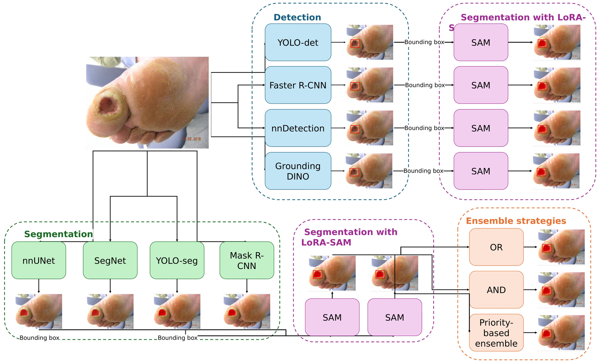
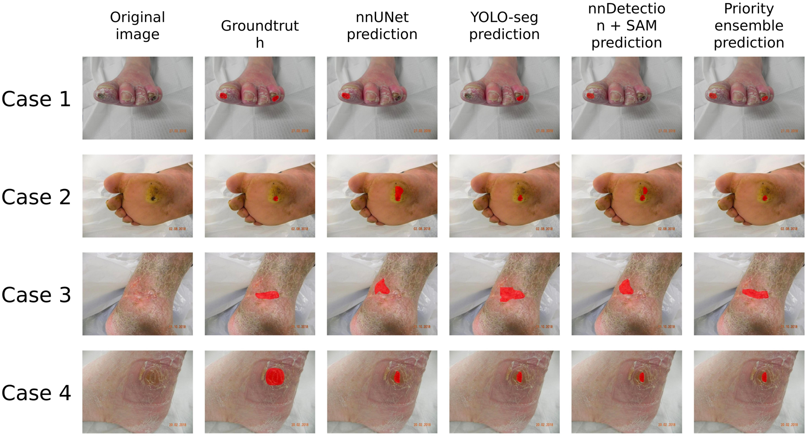

# DFU Detection-Segmentation

Detection-guided segmentation of diabetic foot ulcers (DFU) using foundation models.
A detector (or a segmentation model's own rough mask) localises the ulcer; SAM
(zero-shot or LoRA fine-tuned) then refines the final mask. Benchmarked across
DFUC2020, DFUC2022, DFUC2024 and FUSeg.

Accompanies the paper *"Detection-Guided Segmentation of Diabetic Foot Ulcers Using
Foundation Models: A Comprehensive Benchmark and Analysis"*.

## How it works



A detector (YOLO-det, Faster R-CNN, nnDetection, Grounding DINO) or a segmentation
model (nnUNet, SegNet, YOLO-seg, Mask R-CNN) localises the ulcer with a bounding box,
which prompts SAM (LoRA fine-tuned) to produce the final mask. Predictions from the
two best-performing pipelines are combined with OR / AND / priority-based ensembling.



Example predictions across four cases: nnUNet, YOLO-seg, nnDetection+SAM, and the
priority-based ensemble, against the ground truth.

## Repository structure
configs/ Model configs (e.g. Mask R-CNN, via mmdetection)
detection/ Detection models: YOLO, Faster R-CNN, nnDetection, Grounding DINO + WBF/NMS ensemble
segmentation/ Segmentation models: nnUNet, YOLO-seg, Mask R-CNN, SegNet + OR/AND/priority ensemble
sam/ SAM + LoRA fine-tuning and inference (see sam/README.md)
pipeline/ Detection-guided segmentation pipeline (bbox guide -> SAM)
evaluation/ Detection (Precision/Recall/F1), segmentation (Dice/IoU) and
pipeline-level statistical comparison (Wilcoxon) scripts
src/ Shared utilities: dataset loader, preprocessing, augmentation, metrics
data/ Dataset folders (not tracked in git, see data/README.md)
weights/ Model checkpoints (not tracked in git)


## Setup

```bash
git clone https://github.com/NIC-VICOROB/DFU-detection-segmentation.git
cd DFU-detection-segmentation
pip install -r requirements.txt
```

Framework-specific setup (only needed for the models you use):
- **Mask R-CNN**: `pip install -U openmim && mim install mmengine mmcv mmdet`
- **nnUNet / nnDetection**: run via Docker, see `segmentation/train_nnunet.sh` / `detection/train_nndetection.sh`
- **SAM zero-shot**: `pip install git+https://github.com/facebookresearch/segment-anything.git`
- **SAM + LoRA**: clone `https://github.com/MathieuNlp/Sam_LoRA` into `sam/third_party/Sam_LoRA`, see `sam/README.md`

All scripts are run as modules from the repository root, e.g. `python -m sam.train_lora --config sam/lora_config.yaml`.

## Weights and data

Neither model weights nor datasets are tracked in this repository (see `.gitignore`).
Download checkpoints (SAM ViT-B, YOLO, etc.) into `weights/`, and place datasets under
`data/` following the structure in `data/README.md`. Every script takes explicit
`--images_dir` / `--weights_path` / `--checkpoint` arguments, so paths can point
anywhere on disk if you'd rather not use these default folders.

## Pipeline overview

1. **Detect**: train/run a detector (`detection/`), optionally ensemble with `detection/ensemble_wbf.py`
2. **Segment**: train/run a segmentation model (`segmentation/`), optionally ensemble with `segmentation/ensemble.py`
3. **Refine with SAM**: prompt SAM with either a detector's boxes or a segmentation
   model's predicted-mask boxes via `pipeline/detection_guided_seg.py`
4. **Evaluate**: `evaluation/eval_detection.py`, `evaluation/eval_segmentation.py`,
   and `evaluation/eval_pipeline.py` for statistical comparison across prediction sets

```bash
# 1. Detect
python -m detection.train_yolo --config yolo_baseline
python -m detection.inference_yolo --images_dir data/DFUC/images/test --weights_path weights/yolo_det/best.pt --output_csv results/yolo_predictions.csv

# 2. Segment
python -m segmentation.train_yolo_seg --config yolo_baseline
python -m segmentation.inference_yolo --images_dir data/DFUC/images/test --weights_path weights/yolo_seg/best.pt --output_dir results/yolo_seg_masks

# 3. Refine with SAM (guided by the segmentation model's masks)
python -m pipeline.detection_guided_seg \
    --mask_dir results/yolo_seg_masks --images_dir data/DFUC/images/test \
    --sam_variant lora --lora_weights weights/sam_lora/lora_rank512.safetensors --rank 512 \
    --output_dir predictions/yolo_seg_sam/test

# 4. Ensemble two SAM-refined prediction sets, then evaluate
python -m segmentation.ensemble --mask1_dir predictions/nn_sam/test --mask2_dir predictions/yolo_seg_sam/test --output_dir predictions/ensemble_priority/test --method priority
python -m evaluation.eval_segmentation --gt_dir data/DFUC/masks/test --pred_dir predictions/ensemble_priority/test
```

## Datasets

- **DFUC2020, DFUC2022, DFUC2024**: diabetic foot ulcer detection/segmentation challenges
- **FUSeg**: foot ulcer segmentation, used for out-of-domain evaluation (no fine-tuning)

## Citation

If you use this code, please cite:
